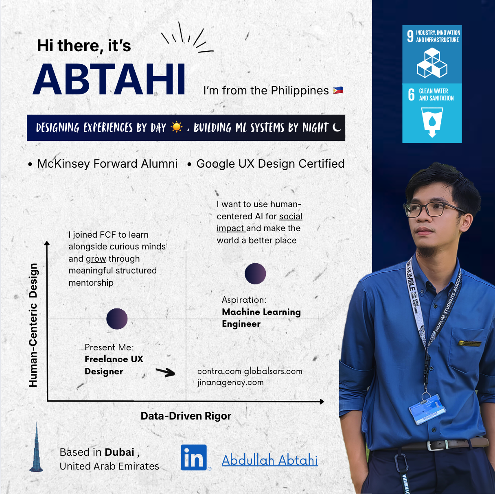
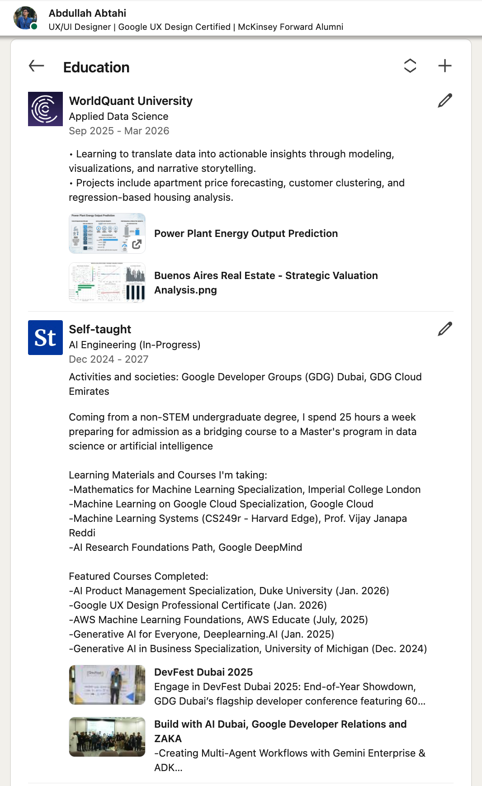

# Abdullah Abtahi
### Data Science • Product Strategy • Digital Systems

> Coming from a non‑STEM business degree, I’m deliberately pivoting into data science and intelligent systems. I build things that translate messy business problems into clear, testable code and experiments.

---

### From Business to Data & AI

Early in my career, I started in marketing and design. Over time, I kept hitting the same wall: decisions were slow, data was noisy, and our systems couldn’t keep up.

Instead of treating “tech” as a black box, I decided to open it. I now spend ~25 hours a week on rigorous self‑study as a bridge into a future **MSc in Data Science or AI**, focusing on first‑principles computer science and the mathematics of learning systems.

My goal: to be the person who advocates for human-centered AI for social impact and make the world a better place

---

### How I Think
My work is defined by the intersection of three methodologies:
1.  **Consulting Precision:** Applying MECE logic and the Pyramid Principle to break down complex problems.
2.  **Startup Agility:** Leveraging YC-style iteration and lean validation.
3.  **Human-Centered Design:** Ensuring every system and algorithm solves a genuine human need with empathy.

I don't just "write code." I design workflows, validate assumptions, and build tools that drive business outcomes.

---

### Selected Projects
* **[Power Plant Energy Output Prediction](https://github.com/abdullahabtahi/Power-Plant-Energy-Output-Prediction):** Predicting hourly net energy output of a Combined Cycle Power Plant using time-aware splits and tree-based ensemble models. *Focus: Data Science & Machine Learning.*
* **[Globalsors Web Design & Development](https://www.globalsors.com/):** Designed and developed a modern, responsive website for a global consulting and industrial supplies. *Focus: Web Design & Development.*

---

### Connect
I value clarity, structure, and brutally honest feedback.
* **LinkedIn:** https://www.linkedin.com/in/abdullahabtahi
* **Email:** abdullah.abtahi@globalsors.com
* **Location:** Dubai, UAE

> *"The biggest quest to learn anything is curiosity."*
